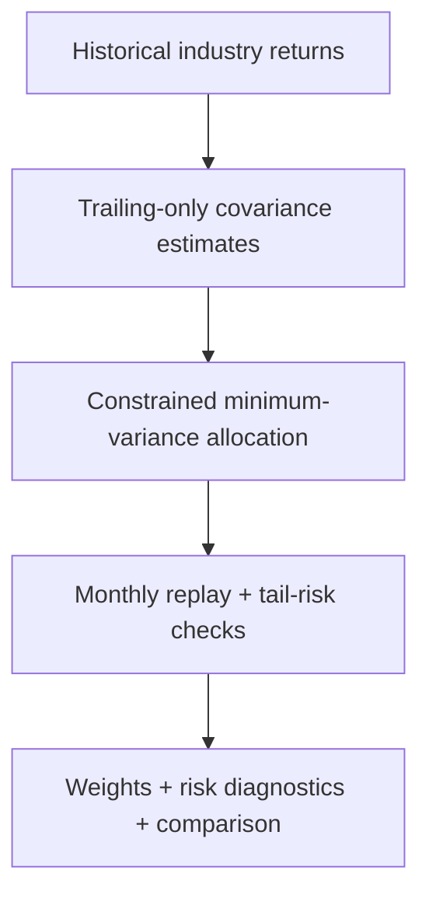

# RiskLens

Project report | Harsh Saand | 22 September 2026

## The problem

A low-volatility portfolio can still have poorly estimated tail risk. RiskLens separates allocation performance from the reliability of the risk estimates used to judge it.

## What a user gets

The system emits constrained monthly allocations, covariance diagnostics and downside-risk exception records for historical industry research baskets.

## Practical value

Lower realised volatility is evidenced in the historical replay, with return and turnover trade-offs. The Gaussian tail forecast remains inaccurate. These are research-basket scenarios, not executable investment recommendations.

## Logic and flow



<details>
<summary><strong>Dataset at a glance</strong></summary>

The Kenneth French **48-industry value-weighted daily-return** dataset is a table of dates × industry research portfolios: **9,067 trading-date observations across 1990-2025**, each with 48 returns. A row is one day's research-basket returns, not an individual stock trade or a directly executable instrument.

1990-2012 supplies historical context, 2013-2018 is the development period for EWMA decay selection, and **2019-2025 supplies 1,760 test days and 84 monthly rebalances**. Each covariance estimate uses only the prior 252 available trading days; this is rolling historical estimation, not a fixed neural-network training split. The downloaded July 2026 source vintage is hash-pinned, with source/protocol details below.

</details>

<details>
<summary><strong>Technical snapshot</strong></summary>

| Question | Implementation |
|---|---|
| What is estimated? | Rolling sample, EWMA and Ledoit-Wolf covariance matrices |
| What is optimized? | Long-only minimum variance, weights sum to one, 15% maximum industry weight |
| Baselines | Monthly equal weight and inverse volatility |
| Data | French 48-industry value-weighted daily returns; 9,067 observations, 1990-2025 |
| Development | 2013-2018; choose EWMA decay from 0.94/0.97/0.99 using realized volatility only |
| Frozen evaluation | 2019-2025: 1,760 trading days and 84 monthly rebalances |
| Risk evaluation | Volatility, drawdown, turnover, covariance conditioning, 95/99% VaR exceptions and stress windows |
| Not demonstrated | Executable instruments, net trading alpha, live deployment, regulatory validation |

</details>

<details>
<summary><strong>Architecture</strong></summary>

### Pre-processing and chronology

The parser selects the **value-weighted daily** table, not the later equal-weighted table. Percentage returns become decimal simple returns. Missing sentinels `-99.99`/`-999` cause the entire date to be removed; no interpolation or forward fill is used. This snapshot has **zero missing dates** within the requested range, January 2, 1990-December 31, 2025.

The downloaded July 2026 CRSP-based snapshot is pinned by SHA-256. Data from 1990-2012 provide historical context; rolling estimation always uses only the prior 252 available trading days. EWMA decay selection uses 2013-2018 only. The other methods, window length, weight cap, rebalance frequency, cost scenarios and stress dates are fixed rather than test-tuned. All three attempted decay values and their development results remain in the report.

### Covariance and optimization

Sample covariance uses the unbiased sample estimate. EWMA normalizes exponentially decaying weights and uses a weighted-centering/effective-sample correction. Ledoit-Wolf estimates its shrinkage intensity on each historical window. A tiny diagonal numerical floor preserves positive definiteness. Audits record the minimum eigenvalue, condition number, maximum weight, history endpoints and shrinkage coefficient where applicable.

SLSQP solves the long-only quadratic program with an analytic gradient, fully invested weights and a 15% per-industry cap. Failed optimization or violated constraints raises an error rather than silently substituting a baseline. Equal-weight and inverse-volatility baselines are separately defined reference allocations, not tuned optimizers.

### Portfolio accounting and risk forecasts

Weights are formed from history ending **before** the first trading day of the month. Holdings drift with each day's returns between rebalances; this is not a hidden daily-rebalanced portfolio. All methods begin each evaluation period from an equal-weight allocation, and the first rebalance incurs its applicable adjustment cost.

One-way turnover is `0.5 * sum(abs(target - drifted_previous_weights))`. Hypothetical costs charge 0/5/10/25 basis points on the **full traded notional**, with net daily return `(1 - cost) * (1 + gross_return) - 1`. Costs do not alter relative holdings because they are deducted proportionally. Underlying industry-basket constituent turnover, spread, borrowing and market impact are not modeled.

VaR uses a zero-mean Gaussian one-day model. Its covariance is **frozen between monthly updates**, while exposure weights drift daily. Exceptions compare gross daily returns with the predicted loss threshold. Kupiec coverage statistics are exploratory diagnostics under idealized assumptions, not regulatory certification or a test of exception independence.

</details>

<details>
<summary><strong>Measured results, with context</strong></summary>

The selected EWMA decay is **0.99**. The following are **gross hypothetical research-basket** outcomes across 1,760 held-out trading days, 2019-2025. See [full results](https://github.com/HarshSaand/risklens/blob/00540ff0be27fd442680bd180d08dd722542cfbe/outputs/evaluation.json) and [source provenance](https://github.com/HarshSaand/risklens/blob/00540ff0be27fd442680bd180d08dd722542cfbe/outputs/provenance.json).

| Method | Annualized volatility | Maximum drawdown | Annual one-way turnover | 99% VaR exceptions |
|---|---:|---:|---:|---:|
| Equal weight | 20.38% | -38.24% | 0.22× | 42 / 1,760 |
| Inverse volatility | 19.32% | -37.36% | 0.24× | 41 / 1,760 |
| Sample min-variance | 15.30% | -29.48% | 1.41× | 43 / 1,760 |
| EWMA min-variance | 15.17% | -28.01% | 1.91× | 42 / 1,760 |
| Ledoit-Wolf min-variance | 15.31% | -29.59% | 1.38× | 43 / 1,760 |

The **2.33-2.44%** observed 99%-VaR exception rates exceed the nominal 1%; lower realized volatility does not rescue the stale Gaussian tail forecast. Shrinkage does not outperform sample covariance on realized volatility in this run.

The risk reduction is not a free return improvement: gross annualized research-basket return is **10.58% for EWMA versus 15.22% for equal weighting**. With a hypothetical 25-bp charge on full traded notional, EWMA's annualized return becomes **9.53%**. These are scenario calculations on research baskets, not achievable investment returns or a recommendation.

Stress reports separately cover February 19-April 30, 2020; calendar 2022; and April 2025. These historically chosen episodes are illustrations, not independent confirmations. Drawdown in each stress slice is measured relative to that slice's starting capital and running peak.

</details>

<details>
<summary><strong>Limitations and next experiments</strong></summary>

- French industry portfolios are research series, not directly executable funds or point-in-time holdings.
- Historical CRSP revisions and the 2025 source-format transition limit investability claims.
- Monthly-frozen Gaussian covariance fails to represent crisis tails; report the failure rather than call the model validated.
- Hypothetical transaction costs omit internal basket turnover and execution constraints.
- One dataset vintage, fixed strategy families and a small predeclared development grid; no broad search or significance-adjusted claim of a winning strategy.
- Next: daily-updated risk forecasts, heavy-tailed innovations, volatility-targeted comparisons and independent-vintage sensitivity, with new holdouts before further model selection.

</details>

<details>
<summary><strong>Using the project</strong></summary>

```bash
python3.12 -m venv .venv
source .venv/bin/activate
python -m pip install -r requirements.txt
python risklens.py prepare
python -m pytest -q
python risklens.py run
```

The authoring host reused a compatible existing Python environment; the same pinned requirements support this standalone setup. There is no trained neural checkpoint to download: covariance models and allocations are re-estimated from historical windows by `run`.

The official URL is updated over time. Exact reproduction requires the original local ZIP with SHA-256 `d7701a576a75b2e1630de546ef4ff614cb54edf62bba52f503a975d50e287b60`. The program refuses a different vintage by default. `python risklens.py prepare --accept-new-vintage` explicitly starts a **new-vintage experiment**, not an exact reproduction of these results.

</details>

## Evidence and reproduction references

Source revision: 00540ff0be27fd442680bd180d08dd722542cfbe

- [README.md](https://github.com/HarshSaand/risklens/blob/00540ff0be27fd442680bd180d08dd722542cfbe/README.md)
- [docs/output-example.json](https://github.com/HarshSaand/risklens/blob/00540ff0be27fd442680bd180d08dd722542cfbe/docs/output-example.json)
- [outputs/evaluation.json](https://github.com/HarshSaand/risklens/blob/00540ff0be27fd442680bd180d08dd722542cfbe/outputs/evaluation.json)

This report describes the source and saved evidence at the revision above. Training and full benchmark runs were not repeated for this documentation release. Dataset, model and dependency licences remain separate from the project documentation.
